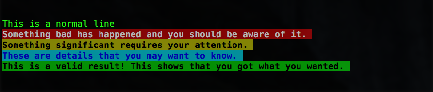
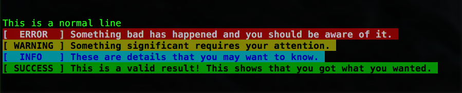
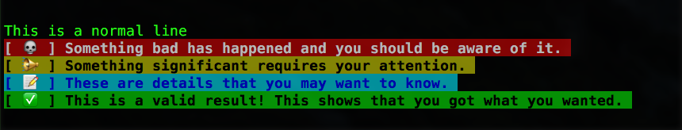

### bootstrap-logs

Many developers are familiar with the bootstrap alert colors. This package brings that color coding familiarity to your console.

Based on the fantastic `chalk` package.


## Why

I found myself using the console for newbie debugging and using tabs, new lines, asterisks, or many other things to organize the output into something readable. I learned about chalk and its amazing ability to add color to the command line. However, as a lazy developer (a good thing), I wanted to minimize typing and complexity as much as possible as well to streamline and generalize the creating of the colorful logs. 

## Install

```console
$ npm install --save bootstrap-logs
```

## Usage

There are five type of colored logs that can be created:
 
 ```js
 log("This is a normal line");
 ```
 
 Prints the line without any colorization.
 
  ```js
  log.danger("Something bad has happened and you should be aware of it.");
  ```
  
  Prints the line with a red background.
 
  ```js
  log.warning("Something significant requires your attention.");
  ```
  
  Prints the line with a yellow background.
  
```js
  log.info("These are details that you may want to know.");
```
    
Prints the line with a cyan background.
    
```js
  log.success("This is a valid result! This show you got what you wanted.");
```
    
Prints the line with a green background.



In a nutshell:

* log(): No color. Handy for bulk or complimentary text.
* log.danger(): Red. Useful to indicate errors and failures.
* log.warning(): Yellow. Useful to indicate warnings or potential failures.
* log.info(): Blue. Ideal to indicate key steps in a process or nice-to-knows.
* log.success(): Green. Great for showing results or satisfactory completion of a task.

*But wait, there is more!*

You can customize your logs by adding an indicator in front of the string that is going to be logged by using the `log.custom()` function.

```js
log.custom({
  danger : "[  ERROR  ] ",
  info   : "[  INFO   ] ",
  warning: "[ WARNING ] ",
  success: "[ SUCCESS ] ",
});

```

`log.custom()` takes an object with four properties (one for each of the log types). Each property takes a string as its value. The string is whatever you want to display before the log message. Using the example above, we would obtain the following logs:



It gets even more fun! You could use emojis as part of your custom header!

```js
log.custom({
  danger : `[ ${String.fromCodePoint(0x1F480)}  ]`,
  info   : `[ ${String.fromCodePoint(0x1F4DD)}  ]`,
  warning: `[ ${String.fromCodePoint(0x1F4E2)}  ]`,
  success: `[ ${String.fromCodePoint(0x2705)}  ]`,
});
```

Give us:



You can find the full list of Code Points for emojis at the [Unicode site](http://unicode.org/emoji/charts/full-emoji-list.html).


I hope that you find this package fun and useful for your projects.

## License

MIT © [DecaHub by Darias](https://www.decahub.com)